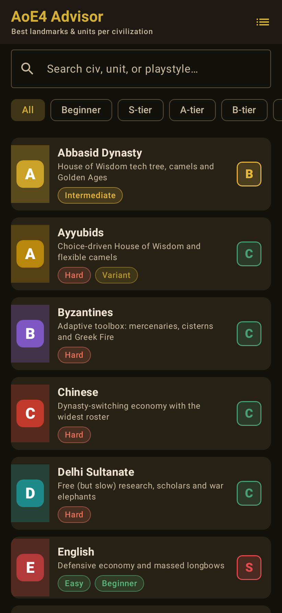
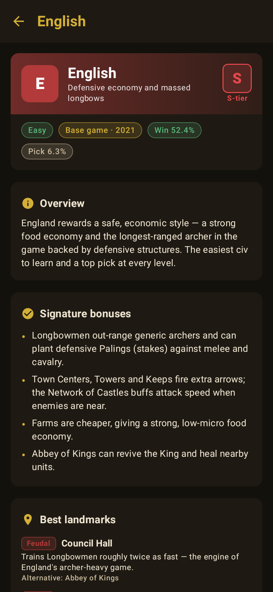
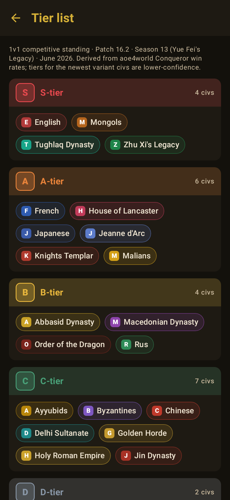

# AoE4 Advisor

An offline **Android companion app for Age of Empires IV** that tells you the **best
landmarks, units, army composition, build order and win condition for every
civilization** — all 23 of them (base game through *Yue Fei's Legacy*, June 2026).

Built as a separate Gradle module (`:aoe4`) alongside the Weldrite game in this repo.
Native **Kotlin + Jetpack Compose**, **Material 3**, no network, no ads, no tracking.

## Features

- **Civilizations list** — search by civ, unit or playstyle; filter by tier or
  "beginner-friendly".
- **Civ detail** — overview, signature bonuses, **best landmark per age** (with the
  reason and the alternative), **best units** (recommended ones highlighted) + the
  recommended core army, build order & win condition, and tier / difficulty /
  win-rate badges.
- **Tier list** — all 23 civs grouped S→D; tap any civ to open its detail.

## Screenshots

Rendered headlessly from the real Compose screens (Robolectric native graphics +
Roborazzi — no emulator). See [`screenshots/`](screenshots/).

| Civilizations | Civ detail | Tier list |
|---|---|---|
|  |  |  |

## Where the data comes from

The dataset is bundled as type-safe Kotlin in
[`data/CivData.kt`](src/main/java/com/aoe4/advisor/data/CivData.kt). It was curated
from a June 2026 research pass over [aoe4world](https://aoe4world.com/), the
[official site](https://www.ageofempires.com/), the
[Age of Empires Series Wiki](https://ageofempires.fandom.com/wiki/Age_of_Empires_IV)
and community tier lists. Tier and win-rate figures are aoe4world **Conqueror** stats
for **patch 16.2 (Season 13)**. Full methodology, citations and confidence notes are in
[`/REPORT.md`](../REPORT.md).

> Unofficial fan project. Age of Empires IV is © Microsoft / World's Edge. Data is for
> non-commercial use per Microsoft's Game Content Usage Rules.

## Architecture

```
com.aoe4.advisor
├─ MainActivity.kt            # single activity, edge-to-edge, hosts Compose
├─ model/Models.kt            # Civ / LandmarkPick / ArmyUnit / BuildOrder + enums
├─ data/
│  ├─ CivData.kt              # the 23-civ dataset (source of truth)
│  └─ CivRepository.kt        # lookup, tier grouping, search
└─ ui/
   ├─ AppNav.kt               # NavHost: list → detail / tier list
   ├─ theme/                  # Material 3 dark "parchment & gold" theme
   ├─ components/             # TierBadge, Pill, SectionHeader, ChipFlowRow…
   └─ screens/                # CivList, CivDetail, TierList
```

Updating the meta each patch = editing `CivData.kt` (compile-checked by
`CivDataTest`). It could later be swapped to load the same shape from the aoe4world
JSON API without touching the UI.

## Build & run

```bash
# Debug APK  ->  aoe4/build/outputs/apk/debug/aoe4-debug.apk
./gradlew :aoe4:assembleDebug

# Release APK (unsigned by default)
./gradlew :aoe4:assembleRelease

# Dataset/unit tests (also re-records the screenshots above via Roborazzi)
./gradlew :aoe4:testDebugUnitTest
```

Requires the Android SDK (platform 34, build-tools 34.0.0) and JDK 17+. Min SDK 29.
